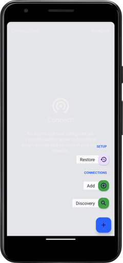
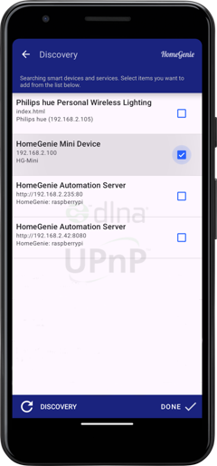
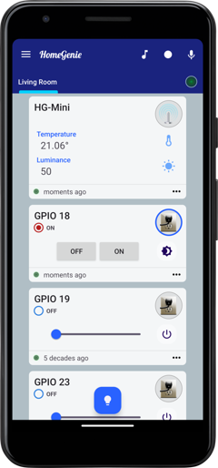
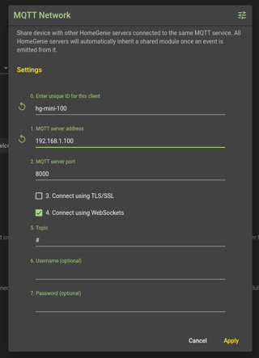
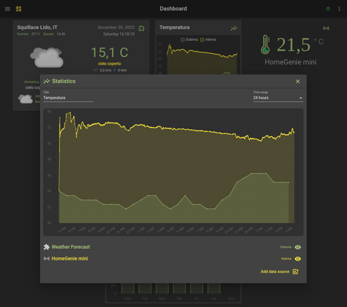

# HomeGenie Mini v1.2 <small>`ESP32 / ESP8266`</small>

HomeGenie mini *(code name **Sbirulino**)* is an **open source library** for building custom firmware for smart devices
based on *ESP32* or *ESP8266* chip.


## Features

- Easy Wi-Fi configuration using Bluetooth (ESP32) or WPS (ESP8266)
- Does not require an Internet connection to be configured or to work properly
- Time synchronization using internal RTC (ESP32), mobile app time or NTP
- Device discovery through SNMP/UPnP advertising with customizable name
- Multi-channel I/O: HTTP, WebSocket, SSE, MQTT
- Status LED
- Configuration/Pairing Button
- Builtin GPIO control API
- Switch level restore on power-on / restart
- Event router
- Simple task manager
- Extensible API
- Can connect directly to *HomeGenie Panel* either via Wi-Fi access point or hotspot/tethering
- Can be easily connected to *HomeGenie Server* via MQTT

## Building and flashing the firmware

The firmware can be installed using [Platform.IO core](https://docs.platformio.org/en/latest/installation.html) CLI.
After installing *Platform.IO core*, download [HomeGenie Mini](https://github.com/genielabs/homegenie-mini/releases) source code,
unzip it and open a terminal with the current directory set to `homegenie-mini` folder.  
Then enter the following commands to install libraries required to build the firmware:

```bash
pio update
pio lib install
```

To actually build and install *HomeGenie Mini* firmware, connect your ESP device to your
PC's USB port and issue the command:

```bash
pio run -e default -t upload
```

**Congratulations!! =)** You've just got a new shiny HomeGenie Mini device up and running.


## Configuration environments

The option `-e default` shown in the previous command is used to specify the configuration environment.
The **default** environment is for building the base firmware for a generic *ESP32* board.

To list all available configurations enter the following command:

```bash
pio project config
```

By editing the `platformio.ini` file is possible to add custom configurations to build your own version
of the firmware to support different hardware and functionality.


## Connecting the device

Once the firmware is installed you can configure and control the device using
the [HomeGenie Panel](https://play.google.com/store/apps/details?id=com.glabs.homegenieplus) app available on Google Play.

The device status LED will blink continuously indicating that the device is not
connected to Wi-Fi, and is in pairing mode accepting connections via Bluetooth.

Enable Bluetooth on your phone, open *HomeGenie Panel* and select the *"Discovery"* option.



The new HG-Mini device will be detected via Bluetooth and the app will display a dialog to
configure the device name and data to connect it to Wi-Fi.
After confirming the settings, the HG-Mini will exit pairing mode, reboot and connect
to Wi-Fi.  
At this point the device will blink slowly (every 2 seconds) indicating that is connected
correctly, and it will appear in the list of detected devices in the *HomeGenie Panel* app.

Select it from the list and click the *"Done"* button. 



Depending on the installed firmware version you will be able to select different kind of modules
to show in the panel dashboard. The following picture refers to the `smart-sensor-d1-mini-esp32`
firmware that implements temperature and light sensor and 4 GPIO switches.




### Connecting to HomeGenie Server

HG-Mini devices can also be connected to [HomeGenie Server](https://github.com/genielabs/HomeGenie)
configuring the *MQTT client* as shown in the following picture.


 
Is then possible to use HG-mini device for automation tasks, logging, statistics and use of all other
features available in *HomeGenie Server*.




## Monitoring via serial port

When the device is connected to your PC's USB port, you can monitor its activity logs
by entering the following command::

```bash
pio device monitor -b 115200
```

**Example output**
```
[1970-01-01T00:00:00.055Z] HomeGenie Mini 1.2.0
[1970-01-01T00:00:00.056Z] Booting...
[1970-01-01T00:00:00.057Z] + Starting HomeGenie service
[1970-01-01T00:00:00.068Z] + Starting NetManager
[1970-01-01T00:00:00.068Z] |  - Connecting to WI-FI .
[1970-01-01T00:00:00.187Z] |  - WI-FI SSID: HG-NET
[1970-01-01T00:00:00.188Z] |  - WI-FI Password: *
[1970-01-01T00:00:00.214Z] |  x WiFi disconnected
[1970-01-01T00:00:00.774Z] |  ✔ HTTP service
[1970-01-01T00:00:00.784Z] |  ✔ WebSocket server
[1970-01-01T00:00:00.786Z] |  ✔ MQTT service
[1970-01-01T00:00:00.791Z] @IO::GPIO::GPIOPort [Status.Level 0]
[1970-01-01T00:00:00.792Z] :Service::HomeGenie [IOManager::IOEvent] >> [domain 'HomeAutomation.HomeGenie' address '14' event 'Status.Level']
[1970-01-01T00:00:00.807Z] @IO::GPIO::GPIOPort [Status.Level 0]
[1970-01-01T00:00:00.809Z] :Service::HomeGenie [IOManager::IOEvent] >> [domain 'HomeAutomation.HomeGenie' address '27' event 'Status.Level']
[1970-01-01T00:00:00.822Z] READY.
[1970-01-01T00:00:00.823Z] @IO::Sys::Diagnostics [System.BytesFree 147128]
[1970-01-01T00:00:00.835Z] :Service::HomeGenie [IOManager::IOEvent] >> [domain 'HomeAutomation.HomeGenie' address 'mini' event 'System.BytesFree']
[1970-01-01T00:00:00.848Z] :Service::EventRouter dequeued event >> [domain 'HomeAutomation.HomeGenie' address 'mini' event 'System.BytesFree']
[2023-12-29T17:01:11.050Z] |  - RTC updated via TimeClient (NTP)
[2023-12-29T17:01:11.053Z] |  ✔ UPnP friendly name: Bagno
[2023-12-29T17:01:11.054Z] |  ✔ SSDP service
[2023-12-29T17:01:11.200Z] |  - Connected to 'HG-NET'
[2023-12-29T17:01:11.201Z] |  - IP: 192.168.x.y
[2023-12-29T17:01:15.048Z] @IO::Sys::Diagnostics [System.BytesFree 143268]
[2023-12-29T17:01:15.049Z] :Service::HomeGenie [IOManager::IOEvent] >> [domain 'HomeAutomation.HomeGenie' address 'mini' event 'System.BytesFree']
[2023-12-29T17:01:15.063Z] :Service::EventRouter dequeued event >> [domain 'HomeAutomation.HomeGenie' address 'mini' event 'System.BytesFree']
```


## Firmwares examples with source code 

In the examples folder you can find some smart device projects using *HomeGenie Mini* library.

### Smart sensor

This example implements a smart sensor with temperature and luminance sensing. It can also control
4 GPIO switches.

The data pins number can be modified from the `configuration.h` file.

**Generic ESP32**
```bash
pio run -e smart-sensor -t upload
```
**D1 Mini - ESP8266**
```bash
pio run -e smart-sensor-d1-mini -t upload
```
**D1 Mini - ESP32**
```bash
pio run -e smart-sensor-d1-mini-esp32 -t upload
```


### Smart sensor with display

A humidity and temperature sensor with touch display. Supports
GC9A01 240x240 round display and CST816S capacitive touch.

**Generic ESP32**
```bash
pio run -e smart-sensor-display -t upload
```

**Round display with integrated ESP32-S3**
```bash
pio run -e smart-sensor-display-s3 -t upload
```


### Shutter control

Wi-Fi controlled shutter motor.

**Generic ESP32**
```bash
pio run -e shutter -t upload
```


### X10 transceiver

Smart Wi-Fi connected X10 transceiver. 

The data pins number can be modified from the `configuration.h` file.

**Generic ESP32**
```bash
pio run -e  x10-transceiver -t upload
```

### RF transceiver

Smart Wi-Fi connected RF transceiver with RF commands capturing and playback.

The data pins number can be modified from the `configuration.h` file.

**Generic ESP32**
```bash
pio run -e  rf-transceiver -t upload
```

### Playground project

Just a generic playground project to mess with the library =)

**Generic ESP32**
```bash
pio run -e  playground -t upload
```

**Generic ESP32 C3**
```bash
pio run -e  playground-c3 -t upload
```


## HomeGenie API

HomeGenie Mini API is a subset of HomeGenie Server API that makes HomeGenie Mini a real
fully working light version of HomeGenie Server specifically designed for microcontrollers.

### [HomeAutomation.HomeGenie](https://genielabs.github.io/HomeGenie/api/mig/core_api_config.html)

Implemented subset:

- [`/api/HomeAutomation.HomeGenie/Logging/RealTime.EventStream/`](https://genielabs.github.io/HomeGenie/api/mig/core_api_logging.html#1)
- [`/api/HomeAutomation.HomeGenie/Config/Modules.Get`](https://genielabs.github.io/HomeGenie/api/mig/core_api_config.html#2)
- [`/api/HomeAutomation.HomeGenie/Config/Modules.List`](https://genielabs.github.io/HomeGenie/api/mig/core_api_config.html#3)
- [`/api/HomeAutomation.HomeGenie/Config/Groups.List`](https://genielabs.github.io/HomeGenie/api/mig/core_api_config.html#4)

`EXAMPLE Request`
```
GET /api/HomeAutomation.HomeGenie/Config/Modules.Get/HomeAutomation.HomeGenie/mini
```

`Response`
```
{
  "Name": "HG-Mini",
  "Description": "HomeGenie Mini node",
  "DeviceType": "Sensor",
  "Domain": "HomeAutomation.HomeGenie",
  "Address": "mini",
  "Properties": [{
    "Name": "Sensor.Luminance",
    "Value": "114",
    "Description": "",
    "FieldType": "",
    "UpdateTime": "2019-01-30T13:34:02.293Z"
  },{
    "Name": "Sensor.Temperature",
    "Value": "18.25",
    "Description": "",
    "FieldType": "",
    "UpdateTime": "2019-01-30T13:34:02.293Z"
  }],
  "RoutingNode": ""
}
```

### HomeGenie Mini builtin API

It's possible to control the 4 GPIOs on the `P1` expansion port using the following API:

- `/api/HomeAutomation.HomeGenie/<pin_number>/Control.On`
- `/api/HomeAutomation.HomeGenie/<pin_number>/Control.Off`
- `/api/HomeAutomation.HomeGenie/<pin_number>/Control.Level/<level>`
- `/api/HomeAutomation.HomeGenie/<pin_number>/Control.Toggle`

Where `<pin_name>` can be `D5`, `D6`, `D7` or `D8` and `<level>` a integer between `0` and `100`.

**Examples**

```
# Set output D6 to 50% (1.65V)
/api/HomeAutomation.HomeGenie/D6/Control.Level/50

# Set output D5 to 100% (3.3V)
/api/HomeAutomation.HomeGenie/D5/Control.Level/100
# or
/api/HomeAutomation.HomeGenie/D5/Control.On

# Set output D8 to 0% (0V)
/api/HomeAutomation.HomeGenie/D8/Control.Level/0
# or
/api/HomeAutomation.HomeGenie/D8/Control.Off
```


---

# Disclaimer

<small><code>
THIS PROJECT IS PROVIDED BY THE COPYRIGHT HOLDERS AND CONTRIBUTORS "AS IS" AND ANY EXPRESS OR IMPLIED WARRANTIES, INCLUDING, BUT NOT LIMITED TO, THE IMPLIED WARRANTIES OF MERCHANTABILITY AND FITNESS FOR A PARTICULAR PURPOSE ARE DISCLAIMED. IN NO EVENT SHALL THE COPYRIGHT OWNER OR CONTRIBUTORS BE LIABLE FOR ANY DIRECT, INDIRECT, INCIDENTAL, SPECIAL, EXEMPLARY, OR CONSEQUENTIAL DAMAGES (INCLUDING, BUT NOT LIMITED TO, PROCUREMENT OF SUBSTITUTE GOODS OR SERVICES; LOSS OF USE, DATA, OR PROFITS; OR BUSINESS INTERRUPTION) HOWEVER CAUSED AND ON ANY THEORY OF LIABILITY, WHETHER IN CONTRACT, STRICT LIABILITY, OR TORT (INCLUDING NEGLIGENCE OR OTHERWISE) ARISING IN ANY WAY OUT OF THE USE OF THIS PROJECT, EVEN IF ADVISED OF THE POSSIBILITY OF SUCH DAMAGE.
</code></small>

---


# Previous release (2019)

## HomeGenie Mini v1.1 (playground board)

[](https://youtu.be/CovB1jl3980)

<small>(click the picture above to watch the video)</small>

**Hardware features**

- WPS button for quick Wi-Fi protected setup
- Temperature and light sensors
- RF transceiver (315/330/433Mhz)
- Expansion connector (P1) with 4 GPIO configurable as SPI/DIO/PWM

*Example applications of the P1 connector:*

- control up to 4 relays to actuate lights and appliances (DIO)
- hosting additional sensors, connecting a display or other hardware (SPI)
- control the brightness of a LED or drive a motor at different speed (PWM)
- breadboard playground

**Firmware features**

- Automatic discovery (SSDP) for instant client setup
- GPIO mapping to virtual modules: switch for digital output, dimmer for analog output or sensor for inputs (work in progress)
- X10 home automation RF protocol encoding and decoding with mapping to virtual modules
- Modules state persistence
- HTTP API (subset of standard HomeGenie API)
- Real time event stream over WebSocket or SSE connection
- MQTT broker over websocket
- NTP client for time sync
- Scripting engine (work in progress)
- Serial CLI with same API as HTTP

## Assembling a HomeGenie Mini device


<small>*HomeGenie Mini board front and rear view*</small>

### STEP 1: Start by soldering the 3 resistors, 2 LEDs, light sensor, temperature sensor and the momentary switch button


### STEP 2: Solder the header pins to the D1 Mini


### STEP 3: Solder the D1 Mini to HomeGenie Mini board


### STEP 4: Optionally solder the RF receiver and transmitter: the firmware currently only support X10 home automation protocol. More protocols might be added in the future (any request?).

The picture below shows a basic HomeGenie Mini device **without** the RF transceiver but adding the RF transceiver is easy as solder [two more components](https://www.google.it/search?q=rf+MX-FS-03V+MX-05V+315+433+transmitter-receiver+module).
You can also take advantage of the expansion port (P1) to connect a [relay module](https://www.google.it/search?q=buy+4+or+2+channels+relay+module+arduino) to control lights and appliances or
any other additional sensors/components required for your projects.


## Components listing

Gerber files required for printing the circuit board are located in the `./pcb` folder.

- https://github.com/genielabs/homegenie-mini/tree/master/pcb

You can use the Gerber file and autonomously get HomeGenie Mini board manufactured from any PCB
print service.

If just need a few boards you can get 3 boards for less than $20 from [AISLER](https://aisler.net/).
Open **AISLER** website and click **Get Started** then you will be able to upload
[HomeGenie Mini Gerber](https://github.com/genielabs/homegenie-mini/raw/master/pcb/HomeGenie_Mini_Gerber_V1.1.25.zip) file and order your PCBs.

The PCB size is 44mm*50mm.

**Components listing**

- 1 ESP8266 WeMoo D1 mini Wi-Fi module (or equivalent)
- 1 DS18B20 (temperature sensor)
- 1 LDR (light sensor)
- 1 FS1000A (RF transmitter)
- 1 XY-MK-5V (RF receiver)
- 1 R1 10kΩ
- 1 R2 4.7kΩ
- 1 R3 330Ω
- 1 R4 330Ω
- 2 LED 3mm
- 1 Push button 6mm*6mm

**Source code**

- https://github.com/genielabs/homegenie-mini/tree/master/src

**Release**

- https://github.com/genielabs/homegenie-mini/releases/
